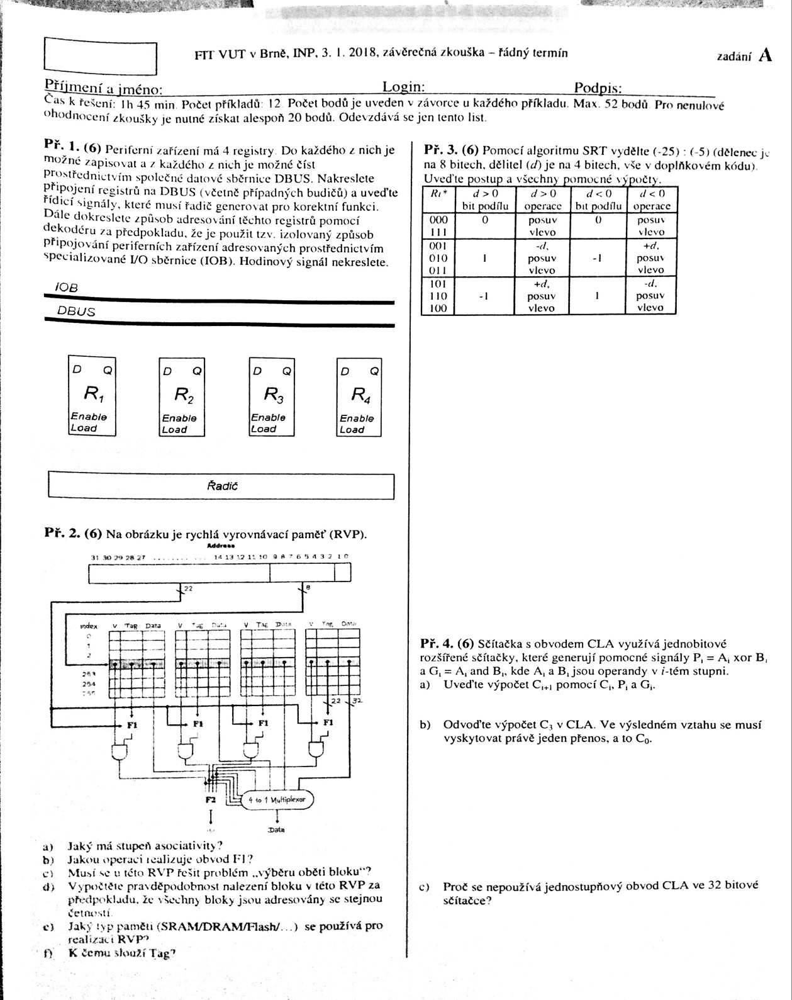
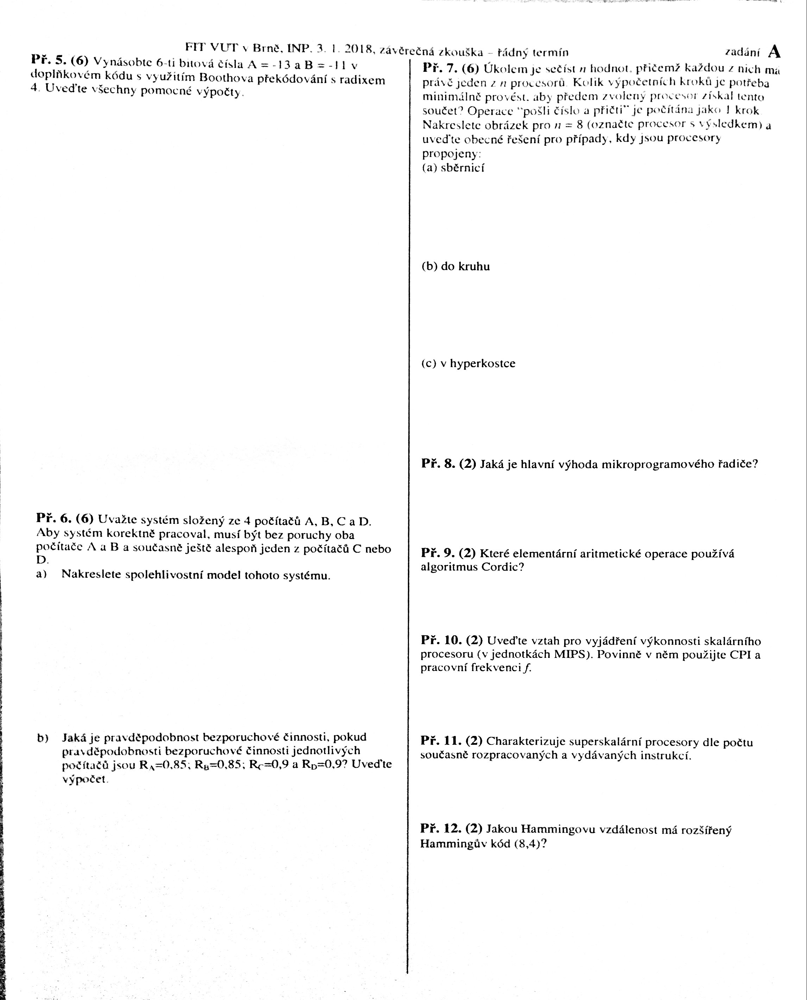

# Zadání 2017

## Skupina A

# Zadání 2016

## Skupina A

1. _(6b)_ Dokreslete datovou cestu mezi ALU a akumulátorem (ACC) a doplňte případné další komponenty (multiplexory...), aby jednoduchý procesor, jehož část je na obrázku, mohl vykonávat instrukce NEG a XOR, kde:
    - NEG je definován jako `ACC := -ACC` (v dvojkovém doplňku)
    - XOR je definován jako `ACC := ACC xor RM` (RM je registr obsahující data z paměti

    

    ALU podporuje operace: `alu_sel = {+, AND, OR, XOR}`. Nezapomeňte, že do ACC zapisují i jiné komponenty než ALU. Doplňte a označte všechny relevantní řídící signály. Níže uveďte nastavení všech řídících signálů tak, aby instrukce mohly být provedeny:
    NEG: alu_sel = .... 
    XOR: alu_sel = ....
1. _(6b)_ Na obrázku je uvedena struktura paměti DRAM, která je složena z modulů s kapacitou 16K x 1bit.
    - Jaká je celková kapacita paměti?
    - Kolik bitů má adresa řádků?
    - Kolik bitů má adresa sloupce?
    - Kolik bitů má adresa bloku?
    - Je uvedná paměť statická nebo dynamická?
    - Jaká je hlavní výhoda blokového čtení z DRAM?

    

1. _(6b)_ Mezi procesor a paměť s dobou přístupu 400ns byla vložena rychlá vyrovnávací paměť (RVP) s dobou přístupu 40ns. Jaká musí být pravděpodobnost zásahu Phit do RVP, aby bylo dosaženo alespoň dvojnásobné urychlení paměťových operací? + Výpočet.

1. _(6b)_ Uveďte tři hlavní typy konfliktů, které mohou vzniknout při řetězeném zpracování instrukcí v procesorech. Ke každému uveďte a vysvětlete jeden mechanismus umožňující konflikt (alespoň částečně) eliminovat.

1. _(6b)_ Na obrázku je neúplná 6-bitová sčítačka s obvodem CLA. EA značí rozšířenou sčítačku.
    - Doplňte do obrázku chybějící vodiče s přenosem Ci.
    - Uveďte, jak se vypočte Gi. Gi = ....
    - S jakým zpožděním bude k dispozici C5? (zpoždění jednoho log. členu označte D)..
    - Jaká je hlavní výhoda tohoto typu sčítačky?

    

1. _(6b)_ Pomocí algoritmu SRT vydělte `-27` / `-5` (dělenec je na 8 bitech), dělitel (d) je na 4 bitech, vše v doplňkovém kódu). Uveďte postup a všechny pomocné výpočty.

    

1. _(3b)_ Stručně charakterizujte pojem "paket" v souvislosti s komunikací na sběrnici USB.
1. _(3b)_ Předpokládejte, že dvoustupový logický člen má zpoždění D. Jaké zpoždění bude mít optimální implementace kodéru rozšířeného Hammingova kódu (8,4)? Vysvětlete, odvoďte.
1. _(2b)_ Kolik tranzistorů tvoří jednu paměťovou buňku v technologii `FLASH MLC` (Multi-level cell)?
1. _(2b)_ Co označuje tzv. dirty bit, který je uchováván u každého bloku (položky) uloženého v rychlé vyrovnávací paměti?
1. _(2b)_ Jak bude v kódu zbytkových tříd s moduly <5,7,11> zakódováno číslo 30?
1. _(2b)_ Jaká je hlavní nevýhoda, pokud je periferní zařízení obsluhováno v cyklu programem (tzv. polling)?
1. _(2b)_ Která komponenta systému třímodulové redundance (TMR) není zabezpečena?

# Zadání 2014/2015

1. Doplň datové cesty pro mapované perfierní zařízení a napiš instrukci pro uložení obsahu střadače do registru Pv
1. TRM - obrázek + výpočet
1. barel shifter 2,4,2
1. RVP - doplnit komponenty schématu a napsat vlastnosti (asociativita, počet bitů celkový atp)
1. Sčítání dvou čísel s mantisou... MxEx + MyEy...
1. SRT -36/6
1. nějaká zřetězená linka, napsat urychlení, jak dosáhnout největšího urychlení (problém byl v tom, že každá komponenta měla jiné "zpomalení")
1. Výhoda blokového DRAM
1. kod zbytkových tříd 5 7 11 myslím a kdy to začne rotovat (opakovat se)
1. Jakou sčítačku použít pokud se potřebuješ vejít do spoždění 20 delta při spoždění členu snad 4 delta při 8 bitech? Tak nějak
1. Co je CPI
